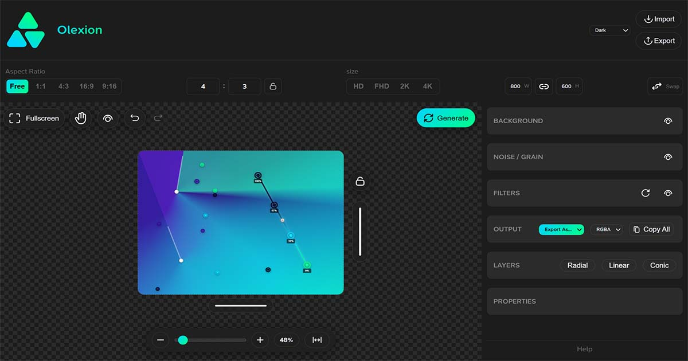

  

<h1 align="center">Olexion</h1>

<strong>Advanced Gradient Designer</strong>

Olexion is a modern gradient design tool for designers and developers to create advanced backgrounds with multi-layer gradients, noise effects, filters, and **responsive CSS export**.

---

## ✨ Features
  
✅ Multi-layer gradient  
✅ noise generator (SVG Fractal Noise)  
✅ Blur, Brightness, Saturation & Advanced Filters  
✅ Blend Modes Support   
✅ CSS Code Export  
✅ Image Export   

---

## 🖼️ Project Preview

  

---

🔗 **pre release:**  
https://mahanfazli.github.io/Olexion/

